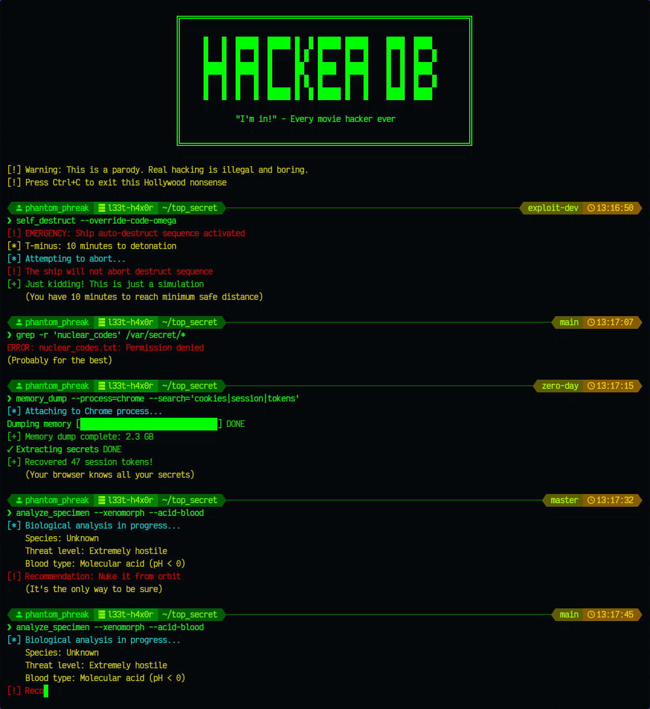

<div align="center">

# 🔓 H A C K E R M I N A L 💀



### ⚡ A parody terminal application that simulates Hollywood-style "hacking" scenes ⚡

```ascii
╔═══════════════════════════════════════════════════════════════╗
║             "I'm in!" - Every movie hacker ever               ║
╚═══════════════════════════════════════════════════════════════╝
```

[](https://golang.org/)
[](https://www.gnu.org/software/bash/)
[](LICENSE)
[](README.md)

</div>

---

## 📖 Description

**Hackerminal** is an entertainment program that recreates the unrealistic and dramatic hacking scenes commonly seen in movies and TV shows. It displays randomized command sequences with fancy terminal effects, complete with progress bars, spinners, and references to popular sci-fi and hacker movies.

> ⚠️ **Warning:** This is a parody. Real hacking is illegal and boring.

## ✨ Features

- 🖥️ **Fancy Terminal Prompt**: CRT phosphor green/amber monochrome terminal style with user, host, directory, git branch, and timestamp segments
- ⌨️ **Typewriter Effect**: Commands and outputs appear character-by-character with realistic typing delays
- 🤔 **Random Thinking Pauses**: Random delays (200ms-2000ms) after prompts to simulate human thinking
- 🎬 **60+ Parody Sequences**: Including references to:
  - 🕶️ Classic hacker movies (The Matrix, Hackers, WarGames)
  - 👽 Sci-fi franchises (Alien, Predator, Terminator)
  - 📺 Popular TV shows (CSI: Cyber, Mr. Robot)
  - 🌐 Internet culture and memes

## 🎨 Visual Effects

- 📊 Progress bars with ASCII characters
- 🔄 Multiple spinner animations
- 🟢 Matrix-style rain effect
- 🌐 Fake IP scanning
- 🎨 ANSI color codes for dramatic output
- 📺 Random screen glitch effects (static, corruption artifacts, horizontal tears)
- 🖥️ CRT scan lines effect (simulates old phosphor monitor with alternating dim lines)
- 💀 ASCII art splash screens (skulls, hacker logos, cyber eyes, trojans, and more)

## 🔊 Audio Effects

- 🔔 **Dramatic Sound Effects**: Custom beep sounds play at critical moments
  - Warnings and alerts (unauthorized access, errors, dangerous situations)
  - Success moments (access granted, passwords cracked, systems breached)
  - Critical revelations (hidden messages found, AI warnings)
  - Task completions (progress bars, spinners finishing)
- 🎚️ **Smart Audio System**: Automatically detects available audio players
  - Supports: `paplay`, `aplay`, `ffplay`, `mpv`, `mplayer`, `cvlc`, `afplay`
  - Cross-platform (Linux, macOS)
  - Falls back to terminal bell if no audio system available
  - **Fully self-contained**: Audio file embedded in binary (no external files needed)
- ⚙️ **Configurable**: Adjust beep frequency via `chanceBeep` constant (default: 15%)

## 🚀 Installation

### 📦 Download Pre-built Binaries

Download the latest release for your platform:

**Linux:**
```bash
wget https://github.com/coltwillcox/hackerminal/releases/latest/download/hackerminal-1.0.3-linux-amd64.tar.gz
tar -xzf hackerminal-1.0.3-linux-amd64.tar.gz
cd hackerminal-1.0.3-linux-amd64
./hackerminal
```

**macOS:**
```bash
curl -LO https://github.com/coltwillcox/hackerminal/releases/latest/download/hackerminal-1.0.3-darwin-arm64.tar.gz
tar -xzf hackerminal-1.0.3-darwin-arm64.tar.gz
cd hackerminal-1.0.3-darwin-arm64
./hackerminal
```

**Windows:**
Download the `.zip` file from [releases](https://github.com/coltwillcox/hackerminal/releases), extract it, and run `hackerminal.exe`.

### 📋 Prerequisites

**Required:**
- 💻 Unix-like terminal (Linux, macOS) or Windows Terminal/PowerShell
- For building from source: Go 1.16 or higher

**Optional:**
- 🔤 [Nerd Fonts](https://www.nerdfonts.com/) - For proper display of icons in the terminal prompt (recommended: JetBrainsMono Nerd Font, FiraCode Nerd Font, or Hack Nerd Font)
- 🔊 Audio player - For sound effects (automatically detected: `paplay`, `aplay`, `ffplay`, `mpv`, `mplayer`, `cvlc`, or `afplay`)

### 🔨 Build

**Quick Build (current platform):**
```bash
make
# or
go build -o hackerminal .
```

**Build for All Platforms:**
```bash
make build-all
# or
./build.sh 1.0.3
```

This creates optimized binaries for:
- Linux (amd64, arm64)
- macOS (Intel, Apple Silicon)
- Windows (amd64, arm64)

**Note**: The audio file (`beep.wav`) is embedded directly in the binary using Go's `embed` package, making each executable fully self-contained. The `assets/` folder is still included in archives for reference, and external audio files take priority if present (allowing customization).

**Build for Specific Platform:**
```bash
make build-linux    # Linux only
make build-macos    # macOS only
make build-windows  # Windows only
```

**Other Build Commands:**
```bash
make run           # Build and run
make audio-test    # Test audio system
make clean         # Remove build artifacts
make install       # Install to /usr/local/bin (Unix-like)
make help          # Show all commands
```

### 🔊 Testing Audio

To verify audio effects are working:

```bash
./test_audio.sh
```

This will check for available audio players and test playback of `assets/beep.wav`.

## 🎮 Usage

### Basic Usage

Simply run the program:

```bash
./hackerminal
```

The program will continuously display random hacking sequences. Press `Ctrl+C` to exit.

> 💡 **Tip:** Run this in front of non-technical people for maximum effect!

### Advanced Usage Ideas

#### 🖥️ As a Screensaver

Use Hackerminal as a screensaver to make your computer look like it's doing important hacking work:

**Linux (with xscreensaver):**
```bash
# Add to ~/.xscreensaver
programs: /path/to/hackerminal -root \n\
```

**macOS (with custom script):**
```bash
# Create a wrapper script that runs hackerminal in fullscreen
#!/bin/bash
clear && /path/to/hackerminal
```

#### 🔒 As a Lock Screen Effect

Impress (or confuse) anyone passing by your desk:

**Linux (using i3lock or similar):**
```bash
# Run before locking
hackerminal & sleep 2 && i3lock
```

**tmux/screen session:**
```bash
# Leave it running in a detached session
tmux new-session -d -s hacker './hackerminal'
# Reattach when you want to show off
tmux attach -t hacker
```

#### 🎬 Display Mode

For presentations or background displays:
```bash
# Run in fullscreen terminal (F11 in most terminals)
./hackerminal
```

> 🎭 **Pro Tip:** Combine with a green or amber terminal color scheme for authentic CRT vibes!

## 🎭 Example Sequences

- 🔐 SSH into fictional systems like "pentagon.gov" or "cyberdyne.sys"
- 🔓 "Crack" passwords and find weak credentials
- 💉 SQL injection demonstrations
- 🔍 "Enhance" images to impossible levels
- 🦠 Deploy viruses that rickroll targets
- 🎪 Many more Hollywood hacking tropes

## ⚙️ How It Works

1. 👤 Generates a random "hacker" username and target system
2. 🖥️ Displays a fancy terminal prompt
3. ⏸️ Pauses randomly to simulate thinking
4. ⌨️ Types out a command with typewriter effect
5. 🎬 Shows dramatic output with animations
6. 🔁 Repeats with a new random sequence

## ⚡ Configuration

The program uses default settings that can be adjusted in `config.go`:

**Timing:**
- ⌨️ **Command typing speed**: 50ms per character (variable by key position)
- 📝 **Output typing speed**: 30ms per character
- 🤔 **Thinking pause**: 200-2000ms random delay
- 📏 **Terminal width**: Auto-detected (defaults to 80 columns)

**Visual Effects Probability:**
- 📺 **Screen glitch**: 10% chance
- 🖥️ **CRT scan lines**: 1% chance
- 💀 **ASCII splash**: 10% chance
- 🌐 **Network topology**: 10% chance
- 🖼️ **Split screen**: 10% chance
- 📁 **File tree**: 10% chance
- ⌨️ **Typos**: 5% chance

**Audio:**
- 🔔 **Dramatic beeps**: 15% chance on critical moments
- 📂 Custom sound: `assets/beep.wav` (automatically plays if audio player available)

## 🎬 Movie References

Hackerminal includes humorous references to:
- 🕶️ The Matrix
- 💾 Hackers (1995)
- 🎮 WarGames
- 👽 Alien franchise
- 🦎 Predator franchise
- 🤖 Terminator franchise
- 🔍 CSI: Cyber
- 🎭 Mr. Robot
- 🌟 And many more!

## ⚖️ Disclaimer

This program is purely for entertainment and educational purposes. It does not perform any actual hacking, network operations, or security testing. All "hacking" activities are simulated text output with sleep delays.

> ⛔ **DO NOT** use this to intimidate, deceive, or misrepresent actual hacking capabilities.

## 📜 License

This is a parody/entertainment project. Use responsibly and ethically.

> 🎭 For entertainment purposes only!

## 🤝 Contributing

Feel free to add more parody sequences, improve visual effects, or add references to your favorite hacker movies!

> 💻 Pull requests are welcome! Let's make this even more ridiculous!

## 🎉 Fun Facts

- 🔑 The password "hunter2" reference comes from a classic IRC joke
- 💉 "Bobby Tables" is a reference to the famous XKCD comic about SQL injection
- 🎬 Many sequences quote iconic movie lines
- 🔤 The program name is intentionally misspelled as "l33t-h4x0r" in the prompt

---

<div align="center">

### 🎬 Enjoy the Hollywood hacking experience! 💻

**Made with 💚 (phosphor green) and 🧡 (amber)**

*"Hack the planet!" - Hackers (1995)*

</div>
